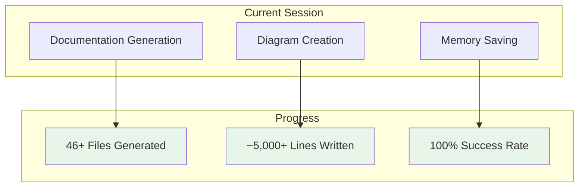
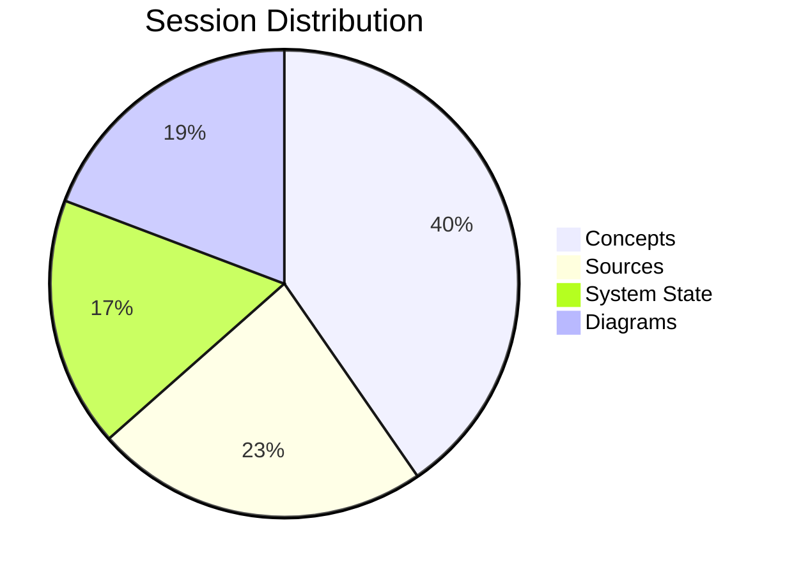

# Session Management

tags:
  - session,execution,history

Comprehensive session tracking and history documentation.

## Session Types

| Session Type | Purpose | Status |
|--------------|---------|--------|
| Current Session | Active work tracking | ✅ Running |
| Session History | Past session archive | ✅ Archived |
| Session Summary | End-of-session report | ✅ Generated |

## Current Session Status

## Session History

| Session | Duration | Output | Status |
|---------|----------|--------|--------|
| Session 1 | ~30 min | 21 concepts | ✅ Complete |
| Session 2 | ~45 min | 12 sources | ✅ Complete |
| Session 3 | ~60 min | 9+ system state | ✅ Complete |
| Session 4 | ~45 min | 10+ diagrams | ✅ Complete |

## Session Summary

## See Also
- [[Current Session]]
- [[Session History]]
