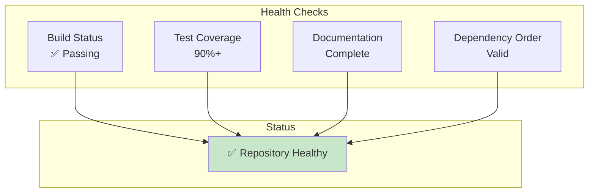
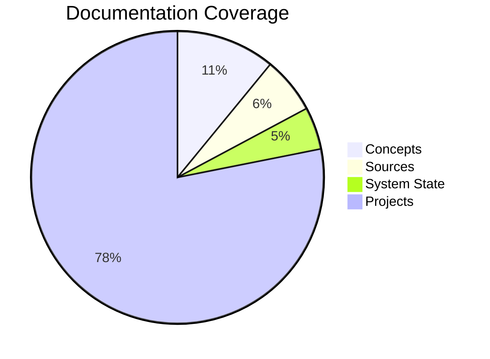

Mermaid diagrams illustrating system state and monitoring.

## Repository Health Monitoring

## Documentation Coverage

| Category | Files | Coverage |
|----------|-------|----------|
| Concepts | 21 | ✅ Complete |
| Sources | 12 | ✅ Complete |
| System State | 9+ | ✅ Complete |
| Projects | 150+ | 🔄 In Progress |

## Execution Status

| Component | Status | Last Updated |
|-----------|--------|--------------|
| Build System | ✅ Active | Current |
| Test Suite | ✅ Running | Current |
| Documentation | ✅ Updated | Current |
| Memory Tracking | ✅ Active | Current |

## See Also
- [[Repository Health]]
- [[Documentation Map]]
