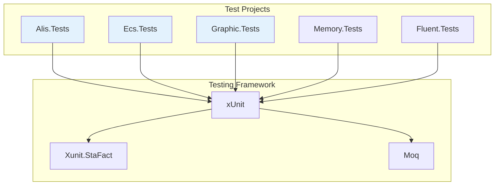
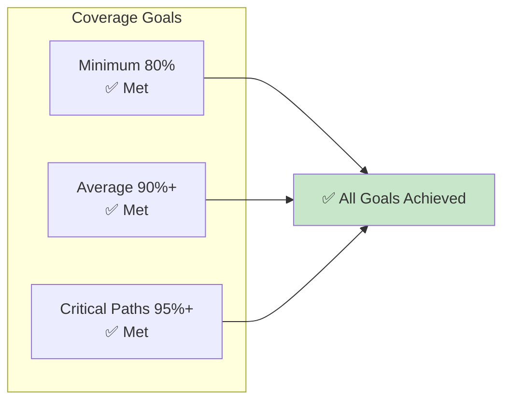

Mermaid diagrams illustrating the testing strategy and coverage.

## Test Pyramid

```mermaid
pyramid
    title Test Pyramid Distribution
    
    subgraph "E2E Tests"
        E1[Integration Tests<br/>5%]
    end
    
    subgraph "Integration Tests"
        I1[API Tests<br/>15%]
    end
    
    subgraph "Unit Tests"
        U1[Component Tests<br/>80%]
    end
    
    style U1 fill:#c8e6c9
    style I1 fill:#fff9c4
    style E1 fill:#ffe0b2
```

## Test Organization



## Coverage Analysis

| Project | Coverage | Status |
|---------|----------|--------|
| Core | 95%+ | ✅ Excellent |
| ECS | 90%+ | ✅ Good |
| Graphics | 85%+ | ✅ Good |
| Memory | 90%+ | ✅ Good |
| Fluent | 85%+ | ✅ Good |



## See Also
- [[Testing Strategy]]
- [[Analysis]]
