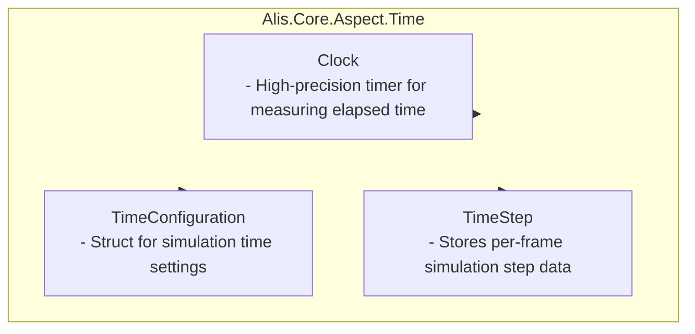
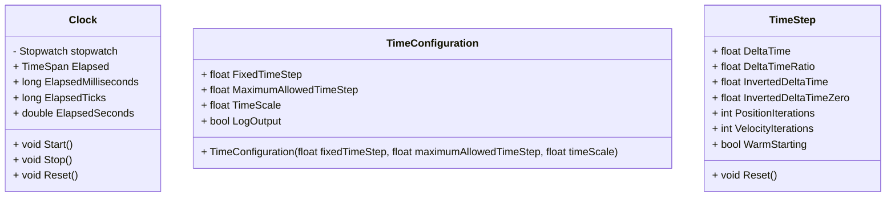

# Alis.Core.Aspect.Time

```mermaid
flowchart TD
    subgraph Module["Alis.Core.Aspect.Time"]
        direction TB
        ClockClass["Clock\n- High-precision timer for measuring elapsed time"]
        TimeConfigClass["TimeConfiguration\n- Struct for simulation time settings"]
        TimeStepClass["TimeStep\n- Stores per-frame simulation step data"]
    end
    Module --> ClockClass
    Module --> TimeConfigClass
    Module --> TimeStepClass
```

## Class Diagram

```mermaid
classDiagram
    class Clock {
        - Stopwatch stopwatch
        + TimeSpan Elapsed
        + long ElapsedMilliseconds
        + long ElapsedTicks
        + double ElapsedSeconds
        + void Start()
        + void Stop()
        + void Reset()
    }

    class TimeConfiguration {
        + float FixedTimeStep
        + float MaximumAllowedTimeStep
        + float TimeScale
        + bool LogOutput
        + TimeConfiguration(float fixedTimeStep, float maximumAllowedTimeStep, float timeScale)
    }

    class TimeStep {
        + float DeltaTime
        + float DeltaTimeRatio
        + float InvertedDeltaTime
        + float InvertedDeltaTimeZero
        + int PositionIterations
        + int VelocityIterations
        + bool WarmStarting
        + void Reset()
    }
```

