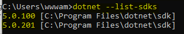
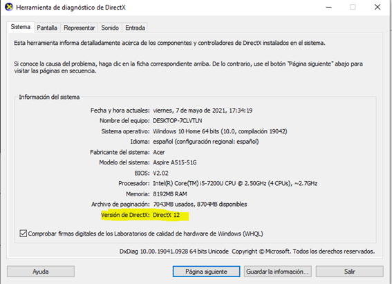
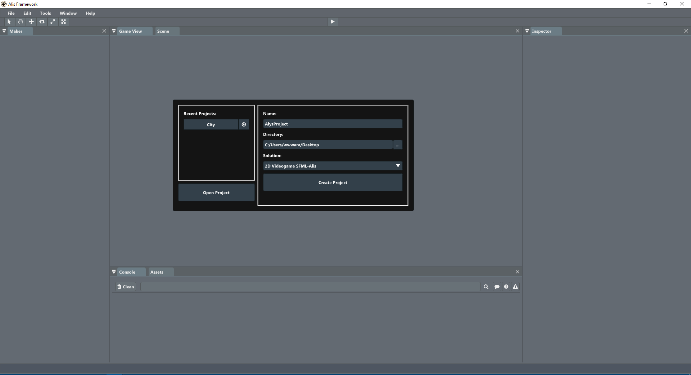
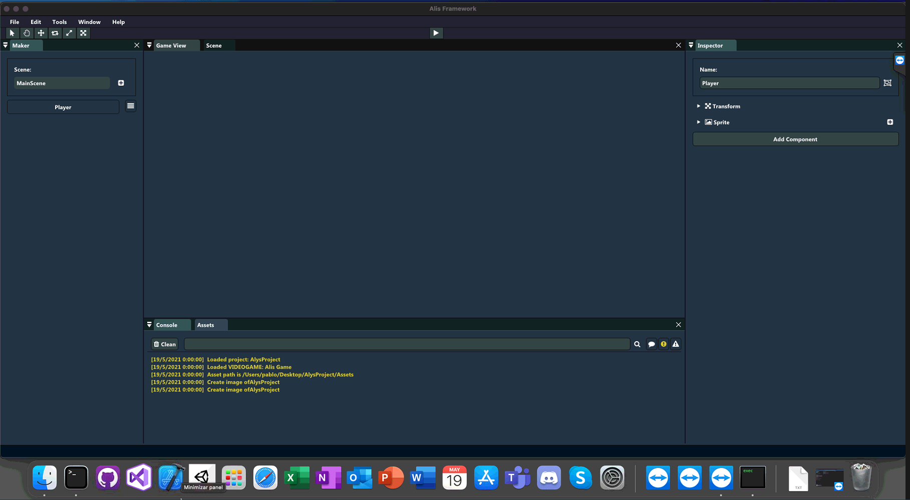
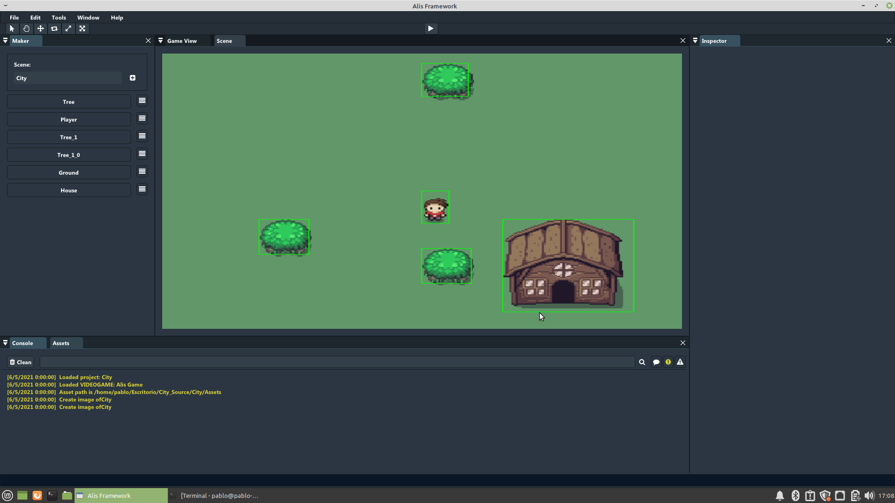
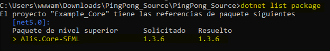

# 1. Quick Start

Before starting with the installation, .NET CORE 5.0 or superior is required in your system.

1.  To know if you have .NET CORE installed and the version, open a command prompt.

    -   Windows: search 'cmd' and open 'command prompt'.

    -   MacOS: go to 'utilities' and select 'terminal'.

    -   Linux: right click on your desktop and click 'terminal'.

2.  In the command prompt, enter the following command:
    
   ~~~~~~~~~~~~~~~{.c}
    dotnet --list-sdks
   ~~~~~~~~~~~~~~~

3.  If you have .NET CORE installed, you should see the following lines:

    

In case of having a previous version, getting "'dotnet' is not recognized as an internal or external command" or another kind of error, you must install the latest version.

-   To ease the installation process we have prepared the following table, with a direct download button for each version.

    | System | Download | 
    | --- | --- | 
    | Windows |            | 
    | MacOS|            | 
    | Linux(Debian)  |  |

-   In case of broken link, you will also find .NET CORE's latest version here:

 

-   Once the download is finished, you should have a wizard. Use it to install .NET CORE normally.

At this point you should have .NET CORE 5 installed and configured.

## Editor

For the proper instalation of the editor it is necessary to have .NET CORE 5 installed and configured. Also, the installation process may vary depending on the OS you are using (Windows, MacOS, Linux)

### Windows 10

If you wish to use Windows, it is recommended to use Windows 10 and on. Also, it is required to have the latest updates of your OS and the latest versions of your GPU drivers.

1.  Firstly, you need to confirm that you have DirectX 11 or greater. Open a command prompt (search 'cmd' and open 'command prompt').

2.  Once open, enter the following command:

    ~~~~~~~~~~~~~~~{.c} 
    dxdiag
    ~~~~~~~~~~~~~~~

3.  If everything is fine, you should see a window indicating your DirectX version.

    
    
4.  Next is downloading the latest version of the editor. You will find a direct link here:

     

    (\*) It is possible that your browser blocks the download. This is normal, just click on 'continue'.

5.  Once the download is finished, unzip the file 'Alis Editor Windows.zip' by right-clicking it and clicking 'unzip' and 'unzip here'.

6.  Open the unzipped file named 'Alis Editor Windows'. You should see a file named 'Alis.exe' inside. Double clicking it should open Alis Editor showing the following:

    

### MacOS 11.4+

In case of using MacOS, you should have the latest system updates and XCODE installed, and you should allow third party applications in the 'Security and Privacy' panel.

1.  To ease the installation a package manager named 'brew' will be used. To install it you have to enter the following command in a terminal:

    ~~~~~~~~~~~~~~~{.c} 
    /bin/bash -c '$(curl -fsSL https://raw.githubusercontent.com/Homebrew/install/HEAD/install.sh)'
    ~~~~~~~~~~~~~~~

2.  To check if it is installed correctly, enter the following command:

    ~~~~~~~~~~~~~~~{.c} 
    brew doctor
    ~~~~~~~~~~~~~~~

3.  If everything is configured correctly, continue by installing the following packages:

    ~~~~~~~~~~~~~~~{.c}  
    brew csfml
    brew sfml
    ~~~~~~~~~~~~~~~

4.  At this point, you only have to download the latest version of Alis Editor. Direct download:

     

5.  Once the download is finished, it should appear a folder named 'Alis Editor Mac'. It is recommended to move it to your desktop, right-clicking, selecting 'open terminal' and executing the foollowing command:

    ~~~~~~~~~~~~~~~{.c}   
    ./Alis
    ~~~~~~~~~~~~~~~

    

### Linux (Debian recommended)

In case of having Linux, a Debian based distribution is recommended. The installation may become challenging, so it is recommended to download the following installation script.

1.  To start the process of installation and configuration, open a terminal and execute the following:

    ~~~~~~~~~~~~~~~{.c}   
    sudo chmod 777 ./Debian_Install_Environment.sh
    sudo ./Debian_Install_Environment.sh
    ~~~~~~~~~~~~~~~

2.  Once the process finishes, validate by entering the following command:

    ~~~~~~~~~~~~~~~{.c}   
    glxinfo | grep 'OpenGL version'
    ~~~~~~~~~~~~~~~

3.  If OpenGL is installed correctly, the console should show a version equal or higher than 3.0.

    

4.  Having installed .NET CORE 5.0 (or higher) and OpenGL 3.0 (or higher) you only have to download the latest version of Alis Editor for Linux. Direct link:

  

5.  Once the download finishes, a '.zip' named 'Alis Editor Linux.zip' should appear. To unzip righ click and click on 'unzip' and then 'unzip here'.

6.  Para finalizar, se debe de abrir una terminal en la carpeta
    recientemente descomprimida, y lanzar el siguiente comando:

    ~~~~~~~~~~~~~~~{.c}  
    ./Alis
    ~~~~~~~~~~~~~~~

If everything is correctly installed and configured you should see:

## Core and/or Tools

If you want to work with Alis without the Editor, you are able to add its core and/or tools to your visual studio project.

Executing the following command inside your working directory will configure your entire project to access the core functionality.

~~~~~~~~~~~~~~~{.c}  
dotnet add package Alis.Core-SFML --version 1.3.6
~~~~~~~~~~~~~~~

In the other hand, if you only want to use Alis tools you should use the following command:

~~~~~~~~~~~~~~~{.c}  
dotnet add package Alis.Tools --version 1.3.6
~~~~~~~~~~~~~~~

You can also donwload the package from here:

 | Package | Download | 
 | --- | --- | 
 |Alis.Core-SFML|  | 
 |Alis.Tools|  | 
    

If you want to confirm that everything is installed correctly you just have to execute these command in your projects directory:

~~~~~~~~~~~~~~~{.c}  
dotnet restore
dotnet list package
~~~~~~~~~~~~~~~

If everything is fine you should see the following result:

