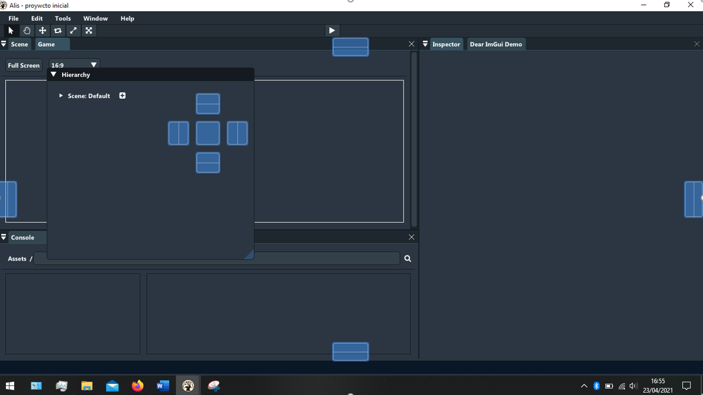

# 3. Editor

The Alis editor offers a cross-platform working environment (Windows,
MacOS and Debian), making it much easier to connect the elements
that make up a video game.

## First steps:

The first thing we will see when starting the editor is a window that
indicates the following lines:

1.  Create a new project: if you want to create a new project, you must
    choose the name of the project, the directory where you want to save it,
    and the type of solution or template you want to use (video games in two
    dimensions using CORE-SFML is the only option for now).
    
2.  Load a recent project: when you have already worked with the
    Editor, a section called 'Recent projects' appears,
    lets you quickly load a project you've already been with
    working. Also if you move the project from the place that
    was saved for the last time, the Editor won't detect it and will remove it
    from the list when trying load the project.

3.  Open an existing project: if you want to load a project, you just have to
    select the 'Project.json' file inside of it. It is recommended to check if
    the contents of the 'Project.json' file are right and that the directories
    really match with the project directory.

## Widgets

The editor includes multiple 'widgets' spread in different windows,
where each one has a unique function explained below:

### Maker

Used to visualize the content of the scene you are making.

### Inspector

Used to see and edit the components that make a 'GameObject'. It also
allows you to add your own customized components.

### Assets

This is one of the most relevant widgets, because it manages all of your
game assets.

### Scene

Scene allows you to preview the content of the scene you are editing.

### Game View

Used to test the game in the middle of its creation, without having to
export the game each time you want to test it, saving some time.

### Console

It shows the messages sent by the editor while you are working.

### AudioPlayer

Audio player embedded in the editor that allows you to play every sound
that is inside your 'Assets' folder.

### TopMenu

In the top menu there are functionalities that you will find interesting
during the development of your project.

1.  'File': Manages different aspects related to your project.

    1.  'New Project': opens the project manager to create a new project.

    2.  'Open Project': allows to load an existing project (use
        'Project.json' file).

    3.  'Save': saves the current state of the project.

    4.  'Autosave': enables or disables a counter that saves the project
        each minute.

    5.  'Build': compiles the game. Ideal when you want to update a customized
        component.

    6.  'Build and Run': exports and run your game.
    
    7.  'Exit': exits from the editor.

2.  'Edit': the tipical editing program options:

    1.  'Cut': cuts elements from the editor.

    2.  'Copy': copies elements from the editor.

    3.  'Paste': pastes elements in the editor.

    4.  'Preferences': to change every style preferences of the editor, you can even change
        the default styles:

        1.  "Dark" Mode

        2.  "Light" Mode

        3.  "Clasic" Mode: Alis first version appearence

    5.  'Project settings': configures the main parameters of your game.

3.  'Tools': show auxiliar tools.

    1.  'Terminal': opens a command prompt.

    2.  'Visual Studio': if you have Visual Studio 2019 installed in your machine, 
        you will be able to work with it at the same time you use Alis.

4.  'Windows': controls the editor windows.

5.  'Help': access to interesting information about the program.

    1.  Manual

    2.  'Check updates': checks for updates. If you are not
        using the latest version of Alis it will give you the
        option to update.

    3.  'About': license and authors.

### BottomMenu

The bottom menu is an auxiliar menu that show info of interest.
It shows a message if you are exporting the game, if the project has just
been saved, when an error occurs...

## Dynamic window manager

The editor includes a window management system or 'widget manager',
that allows to customize at its maximum the IDE. It offers the posibility
of customizing the size, shape and position of the windows.

It only takes to select a window and drag it around to see the possible
positions where you can place it. They will be marked with a lightblue shadow.

