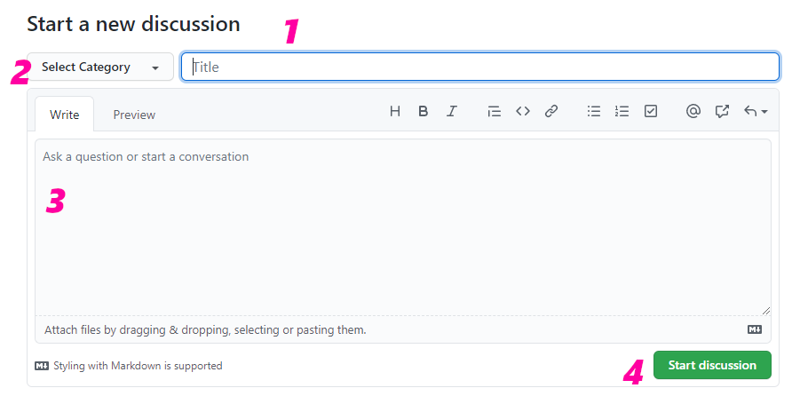
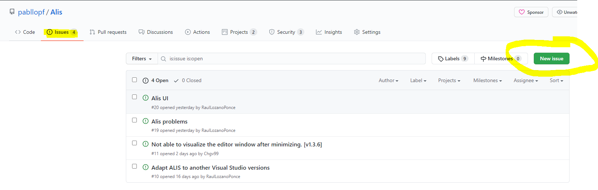
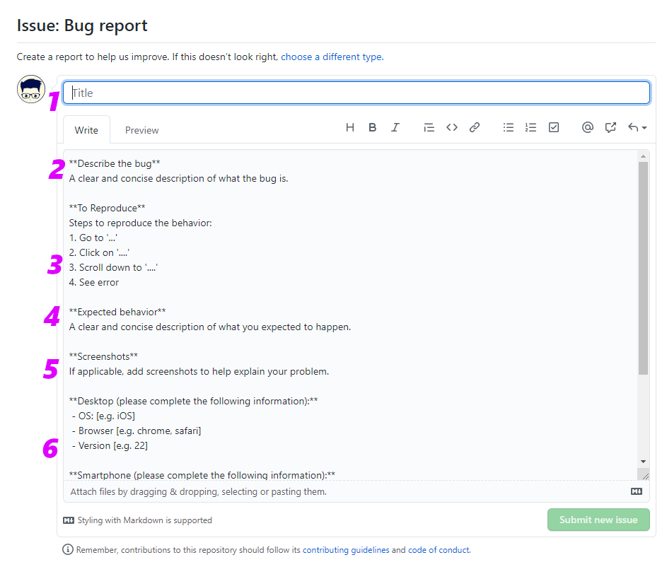

# 6. Useful information

## 6.1 Frequently Asked Questions

During the testing phase and even after publication a set of questions appeared that were frequently asked. Therefore, it has been chosen to include this section within the manual.

### 6.1.1 Is it compatible with visual studio 2017?

The answer is no. We are currently working on finding a solution for users using visual studio version 2017.

### 6.1.2 Can I change my project to a new version of Alis?

The answer is yes and no. If you are working only with the Core or the Tools, there should be no problems when changing to a new version. However, if you were working with an older version of the Editor, there is still no ability to migrate your project to the latest version.

### 6.1.3 I'm trying to load a sample project with the Editor and it won't let me

Some users report that when they are trying to load a sample project, they can't and sometimes the Editor even closes itself. In these cases it is recommended to open the file "Project.json" found inside the project and update the directories that appear with the directory that can be found in the project right now.

### 6.1.4 Can I integrate the tools into an existing project?

The answer is yes. From the outset, this possibility was taken into account, currently allowing tools to be used in any software project, even if it is not a video game.

### 6.1.5 Do I need to know programming to use Alis?

The answer is yes and no. On the one hand, it is true that it is always convenient to know at least a little programming to get the most out of the framework. However, if your case is that of a person who knows absolutely nothing about programming, do not worry, since in the community we can help you with whatever you need and there are several examples prepared to facilitate the task.

## 6.2 Community forum

From the beginning, the community has been listened to and it is something that we will continue to do, therefore, we offer you a section called "discussions" as a public forum where you can make all kinds of queries.

### 6.2.1 How can I participate in the forum?

On the official page of the project there is a section called 'Discussions'. In this section you can participate in the different Forum conversations that are open or you can create a new conversation thread as follows:

As you can see in the previous image, there is a green button that says 'New discussion'. Pressing this button will display a form that must be filled in as follows:

En esta imagen se puede observar el formato de un formulario para
realizar una nueva participación en el foro.

1.  Título: se debe de incluir un título al hilo y se debe ser lo más
    descriptivo posible.

2.  Tema: se debe de seleccionar el tema al que va dirigido el hilo.

3.  Contenido: se debe de incluir la descripción del hilo. Al igual que
    en el título se debe ser lo más descriptivo posible, y de ser
    necesario, se puede añadir imágenes.

4.  Enviar: se debe pulsar el botón verde llamado 'Start discussion'
    para finalizar el proceso.

## 6.3 Panel de incidencias

Como es normal, siempre puede ocurrir un fallo o error por parte del
software que nos perjudica en la interacción con este. Por este motivo
se ha preparado un panel de incidencias donde puedes abrir un canal de
comunicación directo con el desarrollador para que en el menor tiempo
posible dicho problema se pueda solucionar.

### 6.3.1 ¿Cómo puedo reportar una incidencia?

En la página oficial del proyecto existe una sección llamada 'Issues'.
En dicha sección se puede reportar incidencia que se encuentren
utilizando Alis.

Tal y como se puede observar en la imagen anterior, existe un botón
llamado 'New issue' que te permite crear una nueva incidencia. Después
te pedirá que selecciones el tipo de incidencia que te gustaría
reportar:

{width="90%"}

-   'Bug report': indica un fallo / error que debe ser resuelto.

-   'Feature request': de ser necesario urgentemente introducir una
    nueva funcionalidad

-   'Report a security vulnerability': si se ha comprobado una posible
    vulnerabilidad de seguridad le rogamos que lo indique lo antes
    posible en esta sección.

Y una vez decidas que tipo de incidencia te gustaría reportar, solo te
quedaría rellenar el formulario. Dicho formulario ya incluye una
plantilla preparada para que simplemente rellenes lo que necesitas.

1.  Título: se debe incluir un título descriptivo.

2.  Descripción: se debe incluir la descripción de la incidencia
    tratando de ser lo más descriptivo posible.

3.  Pasos para reproducir la incidencia: se debe incluir una breve
    descripción de lo que se tratada de hacer antes de aparecer el
    problema, intentando añadir todos los pasos necesarios.

4.  Que se esperaba: se debe incluir que se suponía que estabas tratando
    de hacer o que esperabas que ocurriera.

5.  Captura de pantalla: si es necesario debes de incluir las capturas
    de pantalla que creas conveniente para entender el problema que se
    reporta.

6.  Información de contexto: se debe de incluir información adicional de
    interés, como puede ser el sistema operativo, la versión de Alis,
    etc.
